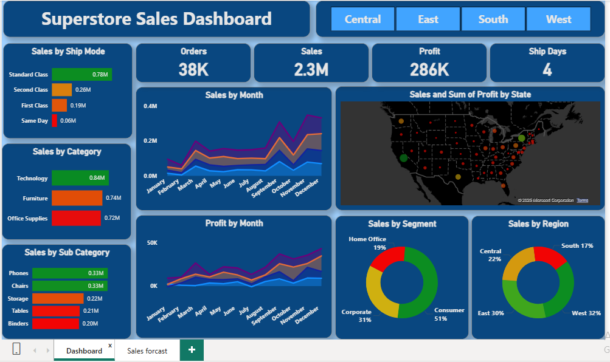
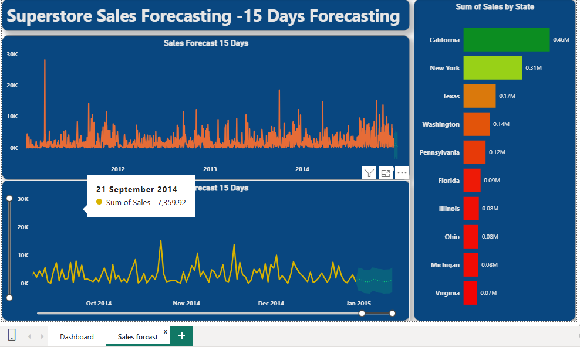

# Comprehensive Superstore Sales and Forecasting Dashboard (Power BI)

## Project Overview
This project provides a detailed analysis of the Superstore Sales dataset using Power BI, with a dual focus: historical performance tracking and short-term sales forecasting.

The dashboard facilitates data-driven decision-making by segmenting sales and profit across critical business dimensions and offering a 15-day sales prediction.

## Dashboard Previews

| Sales Performance Dashboard | Sales Forecasting Analysis |
| :---: | :---: |
|  |  |

## Key Analyses Included
The dashboard covers the following dimensions of analysis, based on Sales and Profit:
* **Geographic:** Sales by Region.
* **Customer:** Sales by Segment.
* **Product Hierarchy:** Sales by Category and Sub-Category.
* **Logistics:** Sales by Ship Mode.
* **Time Series:** Sales by Month, Profit by Month, and a combined Sales & Profit view.
* **Predictive:** 15-Day Sales Forecasting.

### Key Insights & Findings:
Finding 1,: The West Region is a dominant revenue driver, but the Central Region consistently struggles with low Profit Ratio across all ship modes.
Finding 2, : Despite high sales in the 'Technology' category, 'Office Supplies' often yields better month-over-month profit consistency.
Finding 3 : The 15-day forecast indicates a slight upward sales trend for the next two weeks, with the 95% confidence interval showing a potential peak around day 10.

## Technical Skills Demonstrated

| Tool / Skill | Focus |
| :--- | :--- |
| **Power BI Desktop** | End-to-end report design, data visualization, and interactivity (slicers/filters). |
| **DAX Measures** | Creation of explicit measures (e.g., `Profit Ratio`, Time Intelligence functions, etc.). |
| **Power Query (M)** | Data transformation, cleaning, and preparation of the time series data for forecasting. |
| **Time Series Forecasting** | Application of Power BI's built-in forecasting model to predict 15 days of future sales. |
